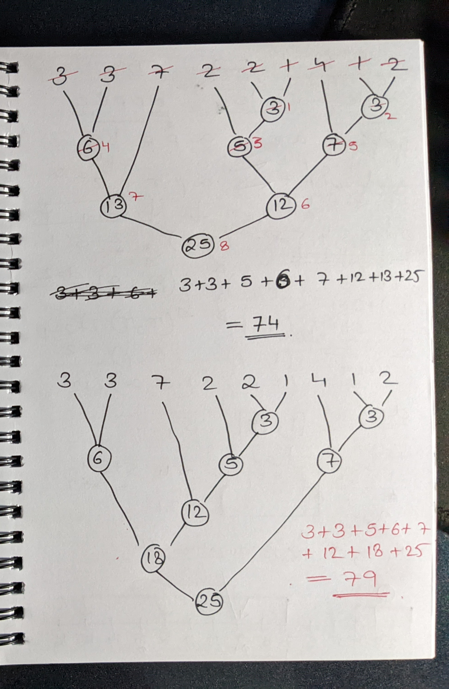

# [1547. Minimum Cost to Cut a Stick](https://leetcode.com/problems/minimum-cost-to-cut-a-stick)

One of the ways is to use RECURSION AND DP.

We can choose to cut at any position. If we cut at that position our cost increases by current length of the rod. Both our 
rod size and cuts array range splits across the cut.

Essentially the recursive function is,
```
func(cuts, rodStart, rodEnd, cutsStart, cutsEnd) = min(
                                                   rodEnd-rodStart+
                                                   i!=cutsStart? func(cuts, rodStart, cuts[i], cutsStart, i-1): 0+
                                                   i!=cutsEnd? func(cuts, cuts[i], rodEnd, i+1, cutsEnd): 0
                                               ), cutsStart <= i <= cutsEnd
```
This recursion exhibits all properties required for us to apply dynamic programming. hence we apply memoization over 
`cutsStart` & `cutsEnd` to prevent re-computations. Works in `O(n*n)` TC and same MC.

Another way is to use **Optimal merge pattern**. As per our beloved internet it works for such problems. But when I applied 
it to this problem it didn't. Why? Have a look at this example. The greedy choice made in above algo fails for duplicate 
minimum's at different times.



Sources:
- [Optimal merge pattern - GFG](https://www.geeksforgeeks.org/optimal-file-merge-patterns/)
- [Abdul Bari - YT](https://www.youtube.com/watch?v=HHIc5JZyenI)
- https://codecrucks.com/optimal-merge-pattern/
- https://www.includehelp.com/algorithms/optimal-merge-pattern-algorithm-and-example.aspx
- https://medium.com/@warlihardik2809/optimal-merge-pattern-32c9d4717e01
- https://leetcode.com/problems/minimum-cost-tree-from-leaf-values/discuss/646785/Greedy-Approach-Optimal-Merge-Pattern(Python)