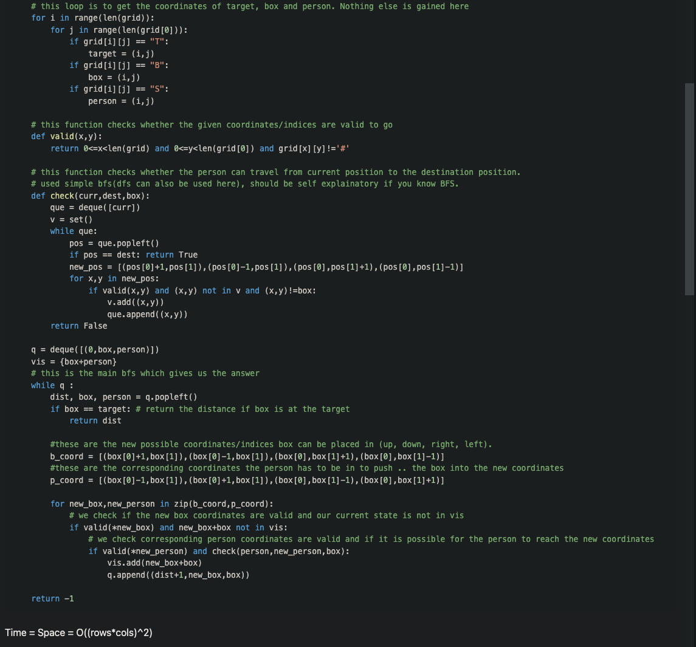

# [1263. Minimum Moves to Move a Box to Their Target Location](https://leetcode.com/problems/minimum-moves-to-move-a-box-to-their-target-location/description/)

[LINK](https://leetcode.com/problems/minimum-moves-to-move-a-box-to-their-target-location/solutions/693918/python-bfs-bfs-130ms-beats-95-explained-commented/)

Thought of the mentioned sol before, but got cold feet while impl. it. Forgot about the fact that I will need to backtrack 
across all BFS routes. Though it would convert to state traversal only.