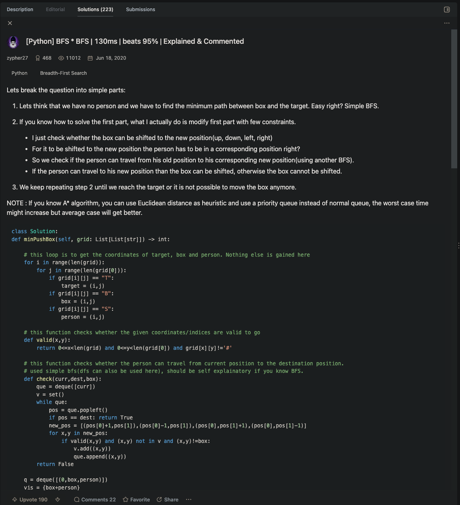

# [1263. Minimum Moves to Move a Box to Their Target Location](https://leetcode.com/problems/minimum-moves-to-move-a-box-to-their-target-location/description/)

[LINK](https://leetcode.com/problems/minimum-moves-to-move-a-box-to-their-target-location/solutions/693918/python-bfs-bfs-130ms-beats-95-explained-commented/)



Thought of the mentioned sol before, but got cold feet while impl. it. Forgot about the fact that I will need to backtrack 
across all BFS routes. Though it would convert to state traversal only. Still I wonder how the below code worked.

```java
class Solution {
        char[][] grid;
        int m, n;
        int[][] DIRS = new int[][]{{0, 1}, {1, 0}, {0, -1}, {-1, 0}};
        boolean[][] reachable; 

        public int minPushBox(char[][] grid) {
            this.grid = grid;
            m = grid.length;
            n = grid[0].length;
            int step = 0;
            boolean[][][] visited = new boolean[m][n][4]; // considering 4 directions
            reachable = new boolean[m][n];

            Deque<int[]> boxQ = new LinkedList<>();
            Deque<int[]> playerQ = new LinkedList<>();
            int[] targetLoc = new int[2];
            for (int i = 0; i < m; i++) {
                for (int j = 0; j < n; j++) {
                    if (grid[i][j] == 'B') boxQ.offer(new int[]{i, j});
                    if (grid[i][j] == 'T') targetLoc = new int[]{i, j};
                    if (grid[i][j] == 'S') playerQ.offer(new int[]{i, j});
                }
            }

            while (!boxQ.isEmpty()) {
                int size = boxQ.size();
                while (size-- > 0) {
                    int[] boxLoc = boxQ.poll();
                    int[] playerLoc = playerQ.poll();
                    if (boxLoc[0] == targetLoc[0] && boxLoc[1] == targetLoc[1])
                        return step;

                    for (int d = 0; d < 4; d++) {
                        if (visited[boxLoc[0]][boxLoc[1]][d]) continue;
                        int[] dir = DIRS[d];
                        int newPlayerR = boxLoc[0] - dir[0], newPlayerC = boxLoc[1] - dir[1];
                        if (newPlayerR < 0 || newPlayerR >= m || newPlayerC < 0 || newPlayerC >= n
                                || grid[newPlayerR][newPlayerC] == '#')
                            continue; //if no space, ignore(/continue)
                        int newBoxR = boxLoc[0] + dir[0], newBoxC = boxLoc[1] + dir[1];
                        if (newBoxR < 0 || newBoxR >= m || newBoxC < 0 || newBoxC >= n
                                || grid[newBoxR][newBoxC] == '#')
                            continue; // if no space for box, ignore(/continue)
                        if (!reachable(newPlayerR, newPlayerC, boxLoc, playerLoc))
                            continue;

                        visited[boxLoc[0]][boxLoc[1]][d] = true;
                        boxQ.offer(new int[]{newBoxR, newBoxC});
                        playerQ.offer(new int[]{newPlayerR, newPlayerC});
                    }
                }
                step++;
            }
            return -1;
        }

        private boolean reachable(int targetR, int targetC, int[] boxLoc, int[] playerLoc) {
            if (reachable[targetR][targetC]){
                return true;
            }
            Deque<int[]> queue = new LinkedList<>();
            queue.offer(playerLoc);
            boolean[][] visited = new boolean[m][n];
            visited[boxLoc[0]][boxLoc[1]] = true; //player cannot go through the spot where the
            // box is located at.

            while (!queue.isEmpty()) {
                int[] curr = queue.poll();
                if (curr[0] == targetR && curr[1] == targetC){
                    reachable[targetR][targetC] = true;
                    return true;
                }
                for (int[] d : DIRS) {
                    int r = curr[0] + d[0], c = curr[1] + d[1];
                    if (r < 0 || r >= m || c < 0 || c >= n || visited[r][c] || grid[r][c] == '#')
                        continue;
                    queue.offer(new int[]{r, c});
                    visited[r][c] = true;
                }
            }
            return false;
        }
}
```